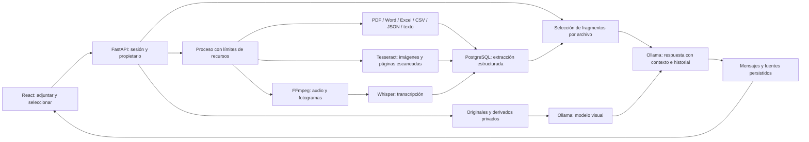

# Adjuntos heterogéneos

La conversación conserva archivos privados del usuario y permite elegir cuáles
aportar al modelo en cada pregunta. La IA puede combinar fragmentos de documentos,
filas de tablas, objetos JSON, OCR, descripciones visuales y transcripciones. La
respuesta incluye las fuentes aportadas al modelo con página, hoja, fila o tiempo;
estas fuentes no certifican automáticamente que cada afirmación sea correcta.

| Entrada | Interpretación |
| --- | --- |
| TXT, MD, LOG | Fragmentos de texto UTF-8/UTF-16 |
| HTML, XML | Texto visible; sin scripts, enlaces ni entidades externas |
| JSON | Valores, tipos y rutas dentro de objetos/arreglos |
| CSV, TSV | Filas y columnas; sumas, mínimos y máximos de valores numéricos inequívocos |
| XLSX | Hojas, filas y resúmenes; solo valores guardados, sin ejecutar fórmulas |
| DOCX | Párrafos, tablas y hasta cuatro imágenes incrustadas compatibles |
| PDF | Texto por página; OCR y visión de hasta cuatro páginas con imágenes o sin texto |
| PNG, JPEG, WEBP, GIF | OCR y modelo visual; primer fotograma del GIF |
| WAV, MP3, M4A, OGG, FLAC | Transcripción con idioma detectado y tiempos |
| MP4, MOV, WEBM, MKV | Cuatro fotogramas repartidos en el video y transcripción de audio si existe |

Se admiten 25 MB por archivo y 20 archivos por conversación. Audio y video deben
conservar una duración conocida de hasta 10 minutos. Documentos: hasta 200 páginas
PDF, 30 hojas Excel, 100 columnas y 5000 filas por tabla. La extracción conserva
hasta 250000 caracteres y 2000 unidades. Se notifican omisiones y límites; divide
archivos grandes para ampliar la cobertura. Las fórmulas de Excel sin valor
calculado guardado pueden aparecer vacías. Los encabezados se limitan a 200
caracteres y los localizadores a 500. No se admiten DOC/XLS binarios antiguos,
macros ni archivos comprimidos arbitrarios: conviértelos a DOCX/XLSX.

El contexto selecciona fragmentos por coincidencia de palabras y prioriza
resúmenes, con un presupuesto separado para cada archivo. No implementa todavía
búsqueda semántica con embeddings ni garantiza cobertura integral. Cada pregunta
admite hasta ocho observaciones visuales. El modelo visual y Whisper pueden
fallar con detalles, nombres propios y ruido; los videos pueden omitir acciones
entre fotogramas. El tamaño del modelo de texto también afecta la precisión.

## API

Todas las rutas de archivos requieren `Authorization: Bearer <sesión>`:

- `POST /attachments`: multipart `file` y `conversation_id` opcional. Sin ID crea una conversación después de extraer con éxito.
- `GET /attachments?conversation_id=<id>`: archivos de la conversación propia.
- `GET /attachments/<id>`: metadatos, advertencias y texto extraído.
- `GET /attachments/<id>/download`: descarga autenticada del original.
- `DELETE /attachments/<id>`: elimina original, derivados y registro del adjunto.
- `POST /chat`: JSON con `prompt`, `conversation_id` y `attachment_ids` opcional. Omitir IDs incluye todos; `[]` excluye todos. Los IDs deben pertenecer a esa conversación y usuario.

Las respuestas generales usan Ollama; si falla o falta un modelo, devuelve 503 y
no guarda una respuesta inventada. Los saludos simples y las preguntas por el
nombre conservan las respuestas breves de la versión anterior. Se conserva la
interpretación de errores de escritura y el texto original en el historial.

## Privacidad y operación

Los nombres se normalizan; el almacenamiento usa UUID en directorios privados.
Los parsers corren con límites de tiempo, memoria y tamaño de salida; esto no es
un contenedor de seguridad independiente. Se valida la estructura Office y se
rechazan entidades XML, texto binario y contenedores demasiado grandes. Se limita
el cuerpo HTTP antes de procesar multipart. Las descargas no se sirven como HTML.
No se ejecutan fórmulas, macros, scripts ni enlaces. Los archivos se tratan como
datos no confiables en los prompts; eso reduce el riesgo de instrucciones
incrustadas, sin garantizar inmunidad del modelo.

Originales en `ATTACHMENT_DIR`, transcripción cacheada en `WHISPER_CACHE_DIR` y
extracción en la base de datos. Respaldar ambos directorios y PostgreSQL. Al
eliminar un adjunto, los mensajes históricos y sus fuentes ya guardadas permanecen
en el historial. La auditoría registra IDs y tipos, no cuerpos de archivos.
Los archivos se envían al endpoint `OLLAMA_URL` para inferencia; configurar uno
remoto cambia quién procesa esos datos. No se suben a Git.

## Validación de esta integración

La suite prueba extracción real de PDF con texto/escaneado, DOCX, XLSX, JSON,
HTML, OCR y video sin audio, además de privacidad, errores, persistencia y uso del
contexto. La prueba de audio decodifica un WAV real con FFmpeg y sustituye solo
la inferencia de voz. Las pruebas de transporte de Ollama y del navegador usan
respuestas controladas. La transcripción real no pudo completarse porque el
proxy negó la descarga de Whisper desde Hugging Face (403). La inferencia real
con los modelos de texto/visión queda pendiente de arrancar Ollama y descargar
los modelos. Pasar estas pruebas no demuestra la precisión de esos modelos.
